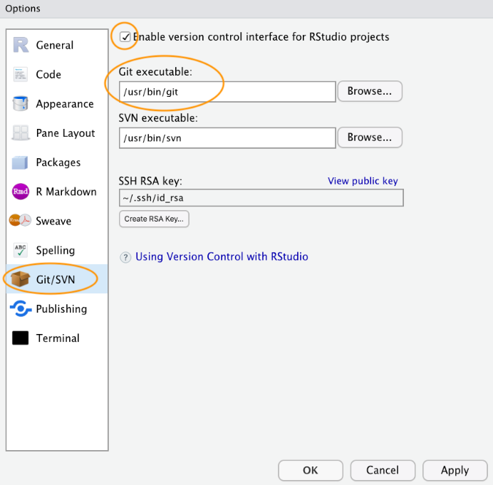

```{r setup, include=FALSE}
knitr::opts_chunk$set(echo = TRUE)
```

# Available books links
[Intro2R](https://intro2r.com/)

[Rmarkdown, the definitive guide](https://bookdown.org/yihui/rmarkdown/)


# Statistical Analysis of (Behavioural) Data in Rmarkdown

## Index: {#go-to-index}

1. [Getting ready](#getting-ready)
    + [Packages for Rmarkdown](#packages-for-rmarkdown)
    + [Create, list and extract directories and files](#create-list-and-extract-directories-and-files)
    + [Import data and visualize data structure](#import-data-and-visualize-data-structure)  
&nbsp;

2. [Rmarkdown tips](#rmarkdown-tips)

3. [Create Version Control (Git)](#create-version-control)
    + [Download](#download)
    + [Configure](#configure)
      + [Git in the PC](#git-in-the-pc)
      + [Git in RStudio](#git-in-rstudio)
    + [Setting up a project in RStudio](#setting-up-a-project-in-rstudio)
    + [Using Git](#using-git)  
&nbsp;

4. [Exploring data and summary statistics](#exploring-data-and-summary-statistics)
    + [Violin plot](#violin-plot-nucleotide-diversity-of-all-genes)
    + [Lollipop chart](#lollipop-chart-top-10-genes-of-the-oxytocin-signalling-pathway)
    + [Scatterplot on two discrete variables](#scatterplot-for-discrete-variables)  
&nbsp;

5. [Inferential Statistics (part I)](#inferential-statistics-i)
    + [Correlation between nucleotide diversity (π) and dNdS ratio (ω)](#corelation-between-nucleotide-diversity)  
&nbsp;

6. [Inferential Statistics (part II)](#inferential-statistics-ii)
    + [Model simplification](##model-simplification)
    + [Data reduction: PCA](#data-reduction)
    + [Multivariate modelling: Generalized Linear Model (glm)](#multivariate-modelling)
        + [Explore data: plot variables](#explore-data)
        + [Multivariate analysis](#multivariate-analysis)
        + [Combined effect of predictors (interaction between two variables)](#combined-effect-predictors)  
&nbsp;

7. [Conclusions](#conclusions)

---


## 1. Getting ready {#getting-ready}
[back to index](#go-to-index)

### Packages for Rmarkdown {#packages-for-rmarkdown}

```{r, eval=FALSE}
install.packages("rmarkdown")
install.packages("tinytex")
tinytex::install_tinytex() # Tinytex is requred to knit on PDF format
library(rmarkdown)
```
### Create, list and extract directories and files {#create-list-and-extract-directories-and-files}

```{r, eval=FALSE}
dir.create("output") # Create directory
dir.create("./output/figures") 
unzip("all_data.zip") # Unzip ZIP file
list.files() # List files on current directory
list.dirs() # List directories on current directory
```

### Import data and visualize data structure {#import-data-and-visualize-data-structure}

I am familiar with these sort of commands and I use them often on my current PhD project. For this reason I do not go into detail.

```{r}
pathways <- read.table(file = "datasets/dataset_overview_pathways.txt", sep = "\t", header = T, stringsAsFactors = T)
```


``summary()`` returns some measures of central tendency of the variables of the data set, whereas ``str()`` only returns the column names and their data type.


```{r}
str(pathways)
```
```{r}
summary(pathways)
```

## 2. Rmarkdown tips {#rmarkdown-tips}
[back to index](#go-to-index)

* ``< Ctr + Alt + I >`` opens a chunk of code
* ``echo = FALSE`` can be added next to the ``{r}`` at the chunks of code that do not need to be shown.
* ``eval = FALSE`` can be added next to the ``{r}`` at the chunks of code that do not need to be run at knitting.
* Introducing images: ``{width=???px, height=???px}``
* ``&nbsp;`` is a special HTML code for a non-breaking space, which can be used in Rmarkdown documents to add empty space between text. 

## 3. Create Version Control {#create-version-control}
[back to index](#go-to-index)

To create a Version Control on Git, a GitHub account is required.

### Download {#download}
Git needs to be installed in the computer. To check if it is installed, the following can be typed in the R terminal: ``git --version``. [Here](https://git-scm.com/downloads) is the link for downloading it.

### Configure {#configure}
#### Git in the PC {#git-in-the-pc}
In the terminal of the computer, this needs to be typed:
```
git config --global user.email 'you@youremail.com'
git config --global user.name 'Your Name'
git config --global --list # Confirm configuration
```
#### Git in RStudio {#git-in-rstudio}
For RStudio to access Git: ``Tools > Global Options > Git/SVN > Git executable > <path_to_git>``

{width=400px, height=400px}

### Setting up a project in RStudio {#setting-up-a-project-in-rstudio}
1. Create a new repository in GitHub with a README file
2. Create a new project with Version Control in RStudio
    + Include the URL of the GitHub repository
  
### Using Git {#using-git}
Four steps on saving the changes (+ extract files):

  + **Save** in local computer (normally)

  + **Stage** the file in Git (brak point in the progress)

  + **Commit** creates a permanent snapshot of changes

  + **Push** to upload on GitHub

  + **Pull** to import from GitHub to local computer


## 4. Exploring data and summary statistics {#exploring-data-and-summary-statistics}
[back to index](#go-to-index)

#### **Violin plot: Nucleotide Diversity of all genes** {#violin-plot-nucleotide-diversity-of-all-genes}

```{r, message=FALSE, warning=FALSE}
library("ggplot2", verbose = F)
library("dplyr", verbose = F)
# Load data
pathgen <- read.csv("datasets/dataset_overview_genes.txt", sep = "\t", header = T)
# Select column to plot
colnames(pathgen)
column_pl <- "nucl_div"
# Group by pathway
pg_by_pway <- group_by(pathgen, pathway)
# Remove NAs for the column of interest
pg_na <- pg_by_pway[!(is.na(paste("dfg$", column_pl, sep = ""))), ]
# Violin plot variable
colors_pways <- c("STEP" = "#F8766D", "DOPP" = "#7CAE00", "VT-R" = "#00BFC4", "SERP" = "#C77CFF", "OXTP" = "#619CFF") # Assign a color to each pathway
plot_pi <- ggplot(pg_na, aes(x=pathway, y=nucl_div, fill=pathway)) +
  geom_point(aes(color=pathway), position=position_jitter(width=0.1), size=0.5, alpha=0.6, stroke = 0.9, color = "black") +
  scale_fill_manual(values = colors_pways, ) +
  scale_color_manual(values = colors_pways) +
  geom_violin(alpha = 0.4, color = "transparent")+
  geom_text(data = subset(pg_na, nucl_div > 0.018), aes(label = gene), vjust = -1, size = 2) + # Label filter points
  theme_minimal()+
  labs(x="Pathway", y="index"~pi*"")+
  ggtitle("Nucleotide diversity ("~pi*")")
# Display plot
plot_pi
# Summary statistics of each pathway
by(pg_na$nucl_div, pg_na$pathway, summary)
```

#### **Lollipop chart: Top 10 genes of the Oxytocin Signalling Pathway** {#lollipop-chart-top-10-genes-of-the-oxytocin-signalling-pathway}

```{r, message=FALSE, warning=FALSE}
library("ggplot2", verbose = F)
library("dplyr", verbose = F)
df_top10 <- read.csv("datasets/oxtp_FEL_dNdS.txt", header = T, sep = "\t")
#Rename columns and select the ones required
colnames(df_top10) <- c("gene", "dNdS", "pos_sites", "total_sites", "site_density")
df_top10_f <-df_top10[1:10,]
df_top10_f <- select(df_top10_f, c(gene, dNdS, site_density))
df_top10_f$site_density <- round(df_top10_f$site_density, round(2)) # Round to 2 decimals

#Order by w value
df_s <- df_top10_f[order(df_top10_f$dNdS, decreasing = T), ]
gene_order = c(df_s$gene)
df_top10_f$gene <- factor(df_top10_f$gene, levels = rev(gene_order))

#Plot
dNdS_top10 <- ggplot(df_top10_f, aes(x = gene, y = dNdS)) +
  geom_segment(aes(x = gene, xend = gene, y = 0.3, yend = dNdS), linetype=2, color = "black", linewidth = 0.6) +
  geom_point(aes(size = site_density), fill = "gray", color = "black", shape = 21, alpha = 1, stroke = 1) +
  geom_text(aes(label = paste(site_density, " %", sep = "")), size = 3, color = "black", hjust = -0.5) +
  scale_size(range = c(1, 10)) +
  labs(title = "Top 10 OXTP genes dNdS ratio. ",
       x = "Gene",
       y = "dN/dS",
       size = "Positive sites\ndensity\n(% of sites)") +
  ylim(0.3, 0.7) +
  theme_minimal() +
  theme(plot.title = element_text(hjust = 0.5, size = 20, face = "bold"),
        axis.title = element_text(size = 12),
        axis.text = element_text(size = 10),
        legend.title = element_text(size = 10),
        legend.text = element_text(size = 10)) + 
  coord_flip()

dNdS_top10
# Summary
summary(df_top10_f)
```

#### **Scatterplot for discrete variables: Pair-bonding vs SNP (ref/alternative)** {#scatterplot-for-discrete-variables}

```{r, message=FALSE, warning=FALSE}
library("ggplot2", verbose = F)
library("dplyr", verbose = F)

df <- read.csv("datasets/EGFR_19907494_PB_BT.txt", sep = "\t")
df2 <- read.csv("datasets/spp-tribe.txt", sep = "\t")

colnames(df) <- c("spp", "PB", "SNP")

# Merge the 2 data frames to link species and tribes
df_final <- inner_join(df, df2, by="spp")

#Plot
SNP_vs_PB <- ggplot(df_final, aes(x = PB, y = SNP, color = tribe)) +
  geom_point(position=position_jitter(width=0.2, height = 0.2)) +
  scale_x_continuous(breaks = c(0, 1), limits = c(-0.2, 1.2)) +
  scale_y_continuous(breaks = c(0, 1), limits = c(-0.2, 1.2)) +
  labs(title = "SNP allele vs phenotype (Pair-bonding)",
       x = "Pair-bonding (0 = No ; 1 = Yes)",
       y = "SNP (0 = Ref ; 1 = Alt)")

SNP_vs_PB
```

## 5. Inferential Statistics (part I) {#inferential-statistics-i}
[back to index](#go-to-index)

### Corelation between nucleotide diversity (π) and dNdS ratio (ω) {#corelation-between-nucleotide-diversity}

We are asking if the nucleotide diversity (index that indicates the level of variability of a set of nucleotide sequences across multiple species) is correlated with the index of positive selection (ω). In the case of the Oxytocin Signalling Pathway, this is how the data looks:
```{r, message=FALSE, warning=FALSE}
library("ggplot2", verbose = F)
library("dplyr", verbose = F)
# Load data
dataset <- read.csv("datasets/dataset_overview_genes.txt", sep = "\t", header = T)
# Select pathway
df_oxtp <- dataset[dataset$pathway == "OXTP",]
# Plot
ggplot(df_oxtp, aes(x=nucl_div, y=dNdS_FEL)) +
  geom_point()
```

If the two variables are correlated, we would expect some sort of linear regression.
To decide what is the apropriate test, we use the [Test Finder](Test_Finder_AQB5th.pdf) in the book Asking Questions in Biology:  

<style>
.custom-table {
  width: 80%;
  margin-left: auto;
  margin-right: auto;
}
th:first-of-type {
    text-align: left;
}
</style>

<div class="custom-table">

| Question                             | Answer    |
| ------------------------------------ | --------- |
| Looking for a difference or a trend? | **Trend** |
| X-values set experimentally?         | **NO**    |
| Type of test:                        | **CORRELATION** |
| Parametric or non-parametric?        | We don't know, so **NON-PARAMETRIC** |
| Test to use:                         | **Spearman rank correlation** |
|                                      |           |

</div>

We compute a Spearman's corelation test, which does NOT assume linearity but only monotony (always same sense -positive or negative-). We do the test for all the five studied pathways

```{r, message=FALSE, warning=FALSE}
# Correlation
oxtp_cor <- cor.test(df_oxtp$nucl_div, df_oxtp$dNdS_FEL, method = 'spearman')
print(oxtp_cor)

# Correlation test for the other pathways (all individually)
df_dopp <- dataset[dataset$pathway == "DOPP",]
df_serp <- dataset[dataset$pathway == "SERP",]
df_step <- dataset[dataset$pathway == "STEP",]
df_vtr <- dataset[dataset$pathway == "VT-R",]

dopp_cor <- cor.test(df_dopp$nucl_div, df_dopp$dNdS_FEL, method = 'spearman')
serp_cor <- cor.test(df_serp$nucl_div, df_serp$dNdS_FEL, method = 'spearman')
step_cor <- cor.test(df_step$nucl_div, df_step$dNdS_FEL, method = 'spearman')
vtr_cor <- cor.test(df_vtr$nucl_div, df_vtr$dNdS_FEL, method = 'spearman')

print(dopp_cor)
print(serp_cor)
print(step_cor)
print(vtr_cor)
```
All pathways provide statistical significance for correlation between (π) and (ω) except for the VT-R. The latter has only 7 points and the inferred rho is negative, as opposed to the rest. This can be due to the low number of observations. However, we can conclude that there seems to be a correlation between nucleotide diversity and dNdS ratio.


## 6. Inf statistics (part II) {#inferential-statistics-ii}
[back to index](#go-to-index)

### Model simplification {#model-simplification}

By using the flowers dataset ([Intro2R book](https://intro2r.com/)) we take the variable **weight** as response to the predictors **height**, **leafarea**, **shootarea**, **flowers**
```{r}
flowers <- read.csv("data/flower.txt", header = T, sep = "\t")
names(flowers)
fl_lm <- glm(data = flowers, formula = weight ~ height + leafarea + shootarea + flowers)
summary(fl_lm)
```

``step()`` function is used to check if any predictor variable could be deleted to decrease the AIC
```{r}
AIC(fl_lm)
step(fl_lm)
```
No variable should be deleted because the full model is the one that has lowest AIC.
All the predictors have a positive effect, although differently distributed.

### Data reduction: PCA {#data-reduction}
``prcomp()`` function.
```{r}
# Select only continuous variables 
flow_red <- flowers[,c("height", "weight", "leafarea", "shootarea")]
fr_m <- prcomp(flow_red, scale = T) # scale = T uses the column standard deviations to center the data. Highly recommendable for data that have substantially different SD
summary(fr_m)
fr_m_c <- prcomp(flow_red, scale = T, center = T) # Center = T uses the column means to center the data. Not necessary in this case but it is recommended in cases where the data is not centered
summary(fr_m_c)
```
<a id="out-frm"></a>Different features from the PCA can be accessed from the model (``fr_m``) to better understand it:
```{r}
# What portion of each variable corresponds to each PCA? (rotation)
print(fr_m)
# The value of each observation in the original dataset projected to the principal components
head(fr_m$x, n = 10) # The entire dataset has 96 observations but here we only print 10 lines
```

Plotting PCA: **biplot** and **screeplot**:

  + **biplot** displays the two PCAs that explain more variability in two dimensions.
  + **scree plot** shows the variance explained as the number of principal components increases.

```{r}
# Biplot
biplot(fr_m)
```

In the biplot we observe that **weight**, **leaf area** and **shoot area** occupy a much larger range of PC1 (x-axis), and negatively correlated. **Height**, on the other hand, covers a much smaller range of PC1 and, in contrast, is much more relevant in PC2 (y-axis). This can be numerically confirmed in the [previous output](#out-frm) of ``print(fr_m)``. In addition, we conclude that **shoot area** and **leaf area** are highly correlated in the data given their similar display in the biplot.

```{r}
# Scree plot
pr.var <- fr_m$sdev^2 # Variability of each PC
pve <- pr.var / sum(pr.var) # Variance explained by each principal component
plot(cumsum(pve), xlab = "Pr. Component", ylim = c(0, 1), type = "b") # Cumulative proportion of variance explained
```

PC1 and PC2 explain almost 80% of the total variance, whereas PC4 only adds about 5%.


### Multivariate modelling: Generalized Linear Model (glm) {#multivariate-modelling}
In this case we will work with the previous dataset (flow_red) including the variable **nitrogen**, which includes three levels: *low*, *medium* and *high*
```{r}
flow_mul <- flowers[,c("nitrogen", "height", "weight", "leafarea", "shootarea")]
flow_mul$nitrogen <- as.factor(flow_mul$nitrogen) # Turn strings into factors
levels(flow_mul$nitrogen)
```

#### Explore data: plot variables {#explore-data}
First we can explore the individual relationship of each variable with the weight. For this, we create a code that can be used for any variable, just by changing the name of the ``var_to_plot``. We can also create a linear model that includes the single variable and call ``summary()`` to explore their statistical correlation.
```{r}
var_to_plot <- "nitrogen"
plot(flow_mul[,var_to_plot], flow_mul$weight, xlab = var_to_plot, ylab = "weight")

# Create a univariate model
formula_simple_model <- paste("weight ~", var_to_plot)
model <- glm(data = flow_mul, formula = as.formula(formula_simple_model))
summary(model)
```
When we model the efect of **nitrogen** on weight, given that the variable has three levels, the code produces a p-value for each level. In this case, they are all highly significant.

#### Multivariate analysis {#multivariate-analysis}
In line with analysing **weight** as a response variable of several predictors, now we create a model that can include all the variables:
```{r}
model_mul <- glm(data = flow_mul, formula = weight ~ nitrogen + height + leafarea + shootarea)
summary(model_mul)
```

The ``summary()`` function provides statistical evidence of a big effect of **nitrogen** (all the p-values are extremely small compared to the rest). The bigger the nitrogen content is, the higher the weight becomes. Therefore, there is a positive correlation. By looking at the other variables, **leaf area** has no effect on weight (considering a p-value of 0.05). **Height** and **shoot area** are significant, although far from the **nitrogen** effect.


#### Combined effect of predictors (interaction between two variables) {#combined-effect-predictors}
Considering a model where nitrogen is not included, we can still find **leaf area** and **shoot area** to be statistically significant. In addition, we can test for the effect of the interaction between two variables. In this case, it can be that both variables independently have a small effect but combined they have much more impact (or the other way around). To do this, we have to include the interaction between these two variables as another variable. In the following model, we test if (although not biologically meaningful) the combination between **height** and **shoot area** (*height\*shootarea*) has an effect that cannot be spotted by looking at each variable individually:

```{r}
model_test <- glm(data = flow_mul, formula = weight ~ height + leafarea + shootarea + height*shootarea)
summary(model_test)
```

After removing **nitrogen** from the model, we see a sudden increase of the effect of the **shoot area** and **height**. This is very likely because of the correlation between **nitrogen** and these two variables. In the last model, **shoot area** and **height** are explaining the effect that was previously attributed to **nitrogen**. The interaction **height:shootarea** is not significant (at a p-value of 0.05) and therefore we can conclude that these two predictors have no other effect than the ones they have individually.

## 7. Conclusions {#conclusions}
[back to index](#go-to-index)

This course was very helpful to refresh some statistical concepts that were a bit forgotten deep in my brain. In addition, it showed me several functions that can be of help for my near future. However, what I would like to highlight the most is the use of Rmarkdown and Version Control. The combination of all these tools has made it a course as enjoyable as helpful. Thanks again, Peter!
